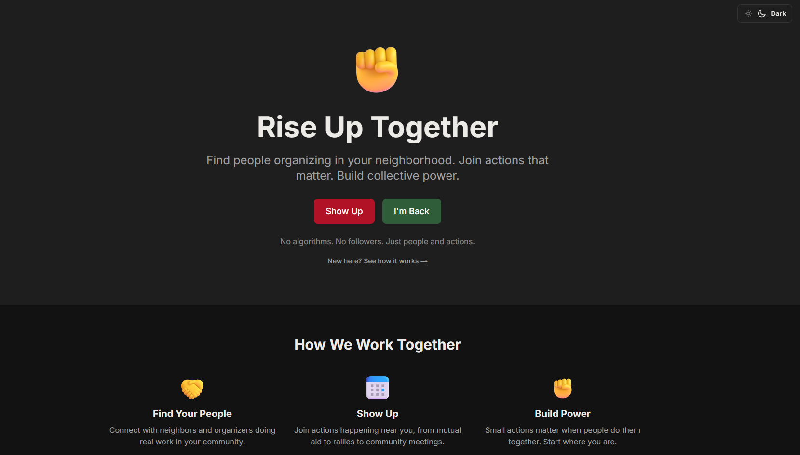
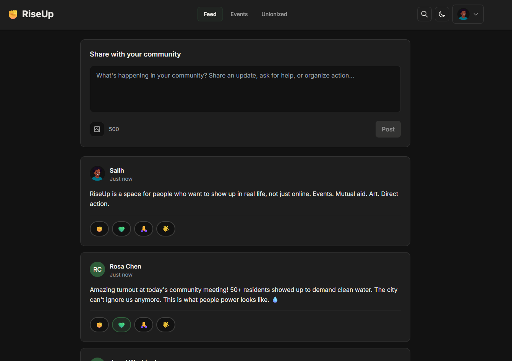
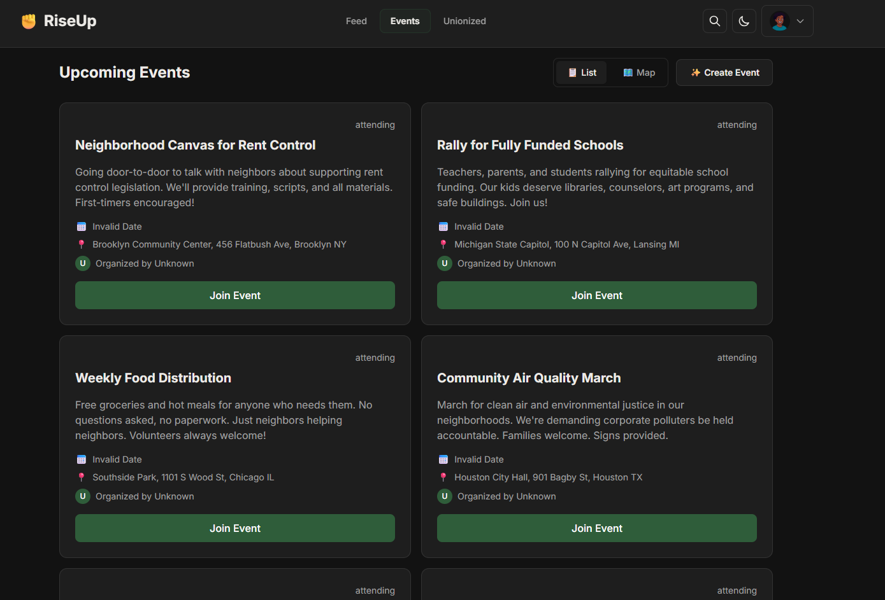
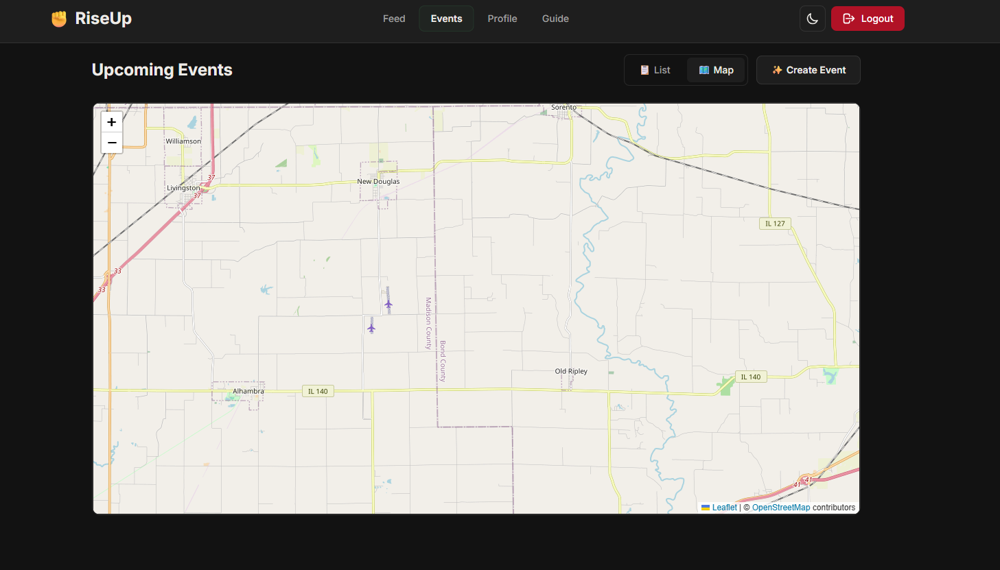
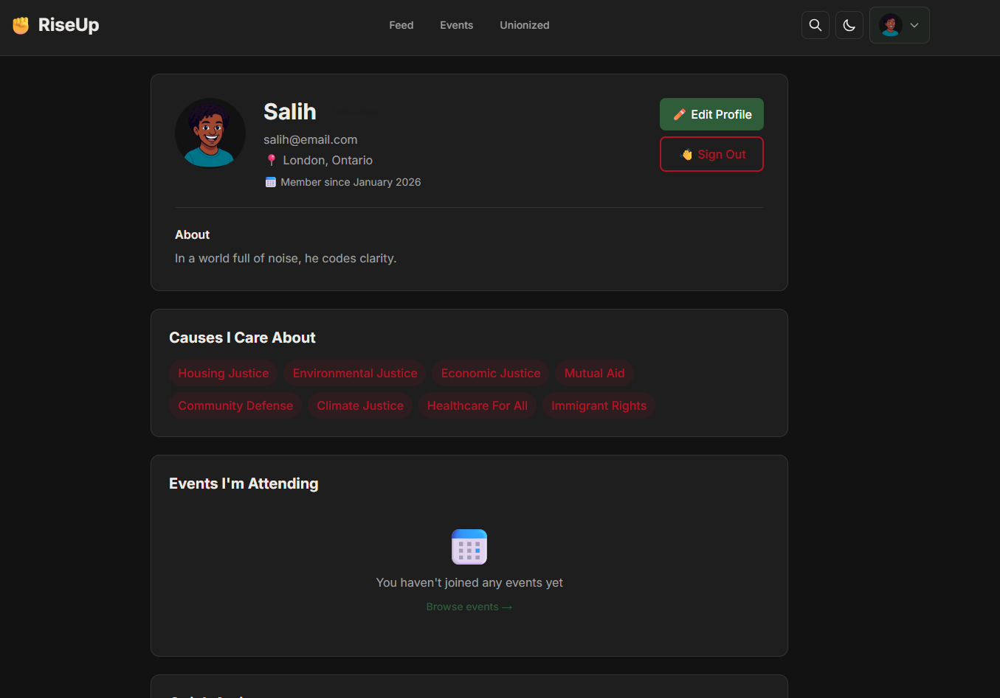
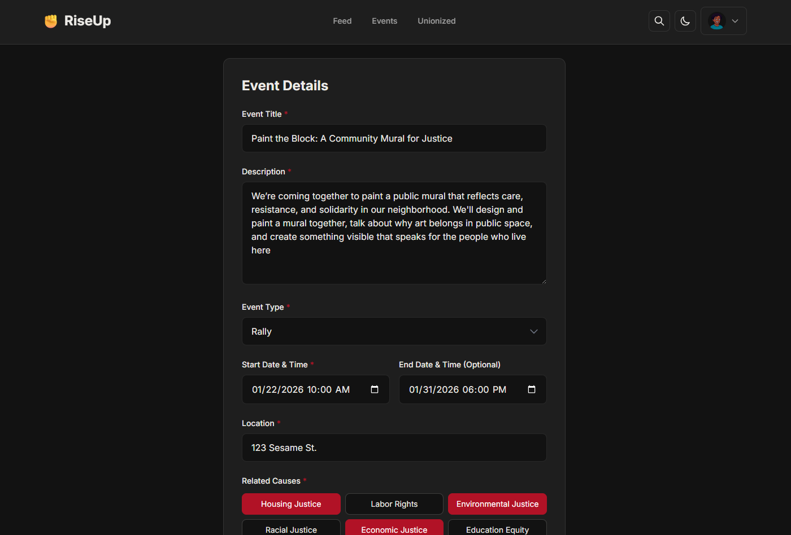

# RiseUp Collective ✊

**Together for Justice, Peace, and Freedom**

*Part of the SPRK ecosystem - community tools for dignity, care, and power*

## Table of Contents

- [What Is RiseUp Collective?](#what-is-riseup-collective)
- [Why It Exists](#why-it-exists)
- [Core Values](#core-values)
- [Quick Start](#quick-start)
- [Project Structure](#project-structure)
- [Implemented Features](#implemented-features)
- [Deployment](#deployment)
- [Screenshots](#screenshots)
- [Documentation](#documentation)
- [The Bigger Picture](#the-bigger-picture)

---

## What Is RiseUp Collective?

**RiseUp Collective** is a platform for people who want to show up, organize locally, and do the work together.

It helps people:

- Come together  
- Plan actions around real community needs  
- Support each other and actually show up  

Online and in the streets.

Think **Twitter for change**, but focused on coordination and care instead of arguing.

This is not a debate platform.  
It is a place to move together.

---

## Why It Exists

A lot of people care.  
A lot of people want to help.  
Most people don't know where to start, who else is already doing the work, or how to plug in.

RiseUp exists to close that gap.

To make it easier to:

- Find local actions  
- Work on problems close to home  
- Turn energy into shared effort and keep going without burning out  

---

## Core Values

### Love  

Care in action. Looking out for each other while doing the work.

### Solidarity  

We move together. No saviors. No lone heroes.

### Empowerment  

Everyone has something to offer. Every voice counts.

---

## Quick Start

### Prerequisites

- Docker Desktop
- Node.js 18+
- Git

### Run Locally

```bash
# Clone and start backend
git clone https://github.com/sakialabs/RiseUp.git
cd RiseUp
docker-compose up -d

# Run web frontend
cd web && npm install && npm run dev

# Run mobile app
cd mobile && npm install && npm start
```

**Demo Accounts:** Password is `password123`
- `maya@riseup.local`
- `jamal@riseup.local`
- `collective@riseup.local`

For detailed setup instructions, see [docs/setup.md](docs/setup.md).

---

## Project Structure

```plaintext
RiseUp/
├── backend/             # FastAPI backend API
│   ├── app/
│   │   ├── api/v1/      # API endpoints
│   │   ├── core/        # Configuration & security
│   │   ├── db/          # Database session
│   │   ├── models.py    # SQLModel data models
│   │   └── schemas.py   # Pydantic schemas
│   ├── alembic/         # Database migrations
│   └── scripts/         # Seed data
│
├── web/                 # Next.js web frontend
│   ├── app/             # Pages (App Router)
│   ├── components/      # React components
│   └── lib/             # API client & utilities
│
├── mobile/              # React Native + Expo
│   ├── app/             # Screens (Expo Router)
│   ├── components/      # UI components
│   └── lib/             # API client, auth, theme
│
└── docs/                # Documentation
    ├── vision.md        # Vision & manifesto
    ├── requirements.md  # Feature requirements
    ├── design.md        # Architecture & design
    ├── setup.md         # Setup instructions
    ├── tasks.md         # Implementation roadmap
    ├── tone.md          # Language & tone guide
    └── styles.md        # Visual design system
```

---

## Implemented Features

### Backend (FastAPI)

- ✅ Authentication (JWT, registration, login)
- ✅ Profiles (user & organization with causes)
- ✅ Events (create, browse, join/leave, attendance)
- ✅ Posts (community text updates)
- ✅ Reactions (Care, Solidarity, Respect, Gratitude)
- ✅ Feed (chronological events and posts)
- ✅ Map API (events with coordinates)
- ✅ Database seeding with demo data

### Web Frontend (Next.js)

- ✅ Authentication pages with validation
- ✅ Community feed with events and posts
- ✅ Event management (browse, create, RSVP)
- ✅ Interactive map (Leaflet with event markers)
- ✅ Post creation modal
- ✅ User profiles with attending events
- ✅ Dark/light theme toggle
- ✅ Responsive design

### Mobile App (React Native + Expo)

- ✅ Auth screens (login & registration)
- ✅ Feed with pull-to-refresh
- ✅ Events (list, map, detail screens)
- ✅ Map integration (react-native-maps)
- ✅ Profile with causes and events
- ✅ Bottom tab navigation
- ✅ Theme support

---

## Screenshots

<details>
<summary><strong>Click to view screenshots</strong></summary>

> **Note:** Screenshots coming soon! See [docs/screenshots/README.md](docs/screenshots/README.md) for guidelines.

### Web Application

#### Home & Feed
<p align="center">
  
  
</p>

#### Events & Map
<p align="center">
  
  
</p>

#### Profile & Event Creation
<p align="center">
  
  
</p>
</details>

---

## Documentation

- [Vision & Manifesto](docs/vision.md) - The why, how, and ecosystem (includes SPRK & Unionized)
- [Requirements](docs/requirements.md) - Feature specifications
- [Design & Architecture](docs/design.md) - Technical design
- [Tone & Language](docs/tone.md) - Communication guidelines
- [Visual Design](docs/styles.md) - Design system
- [Changelog](docs/CHANGELOG.md) - Version history
- [Setup Guide](docs/setup.md) - Development setup (API, web & mobile)
- [Tasks](docs/tasks.md) - Implementation plan
- [Roadmap](docs/roadmap.md) - Future features
- [Deployment](docs/deployment.md) - Production deployment

---

## The Bigger Picture

RiseUp Collective is part of the **SPRK ecosystem**, community tools built around dignity, care, and collective power.

### The Ecosystem

**RiseUp Collective** helps people organize locally and take action together.

**Unionized** helps workers find fair work with transparent wages and real protections.

**SPRK** is the connective layer - the shared principles that keep both tools grounded:
- People over platforms
- Action over metrics
- Calm over urgency
- Dignity over growth
- Systems over hype

### How They Work Together

RiseUp builds community power through organizing.

Unionized builds worker power through fair employment.

Both reject algorithms, engagement metrics, and growth hacking.

Both use clear language and respect people's time.

Both drive toward real-world action, not online noise.

**Put simply:**

RiseUp helps people show up and organize.

Unionized helps people work with dignity.

SPRK keeps both tools honest.

Read the full vision in [docs/vision.md](docs/vision.md)

---

Built with 💖 for people who want to build a better world.
